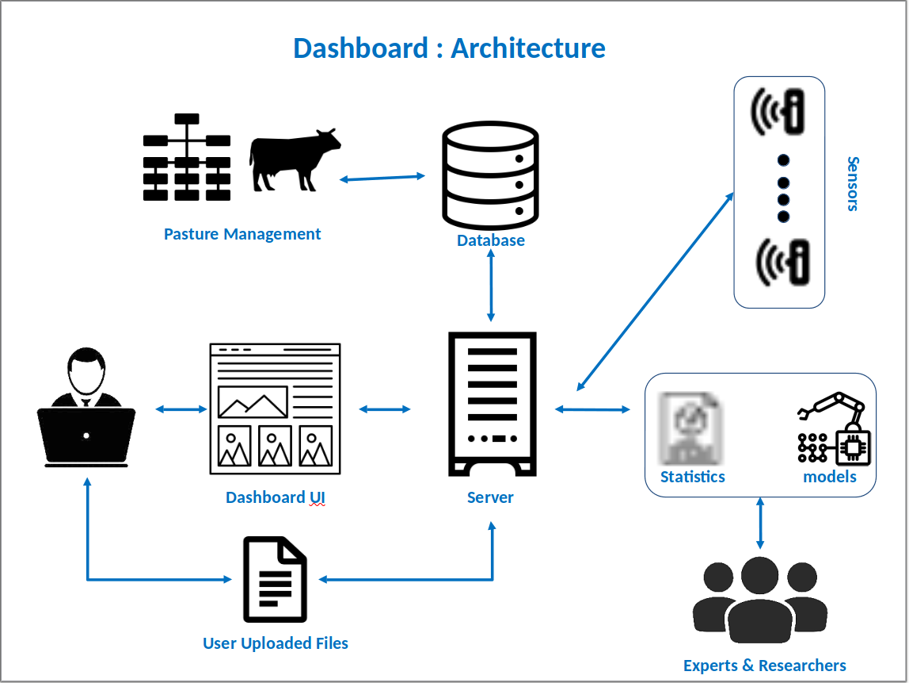
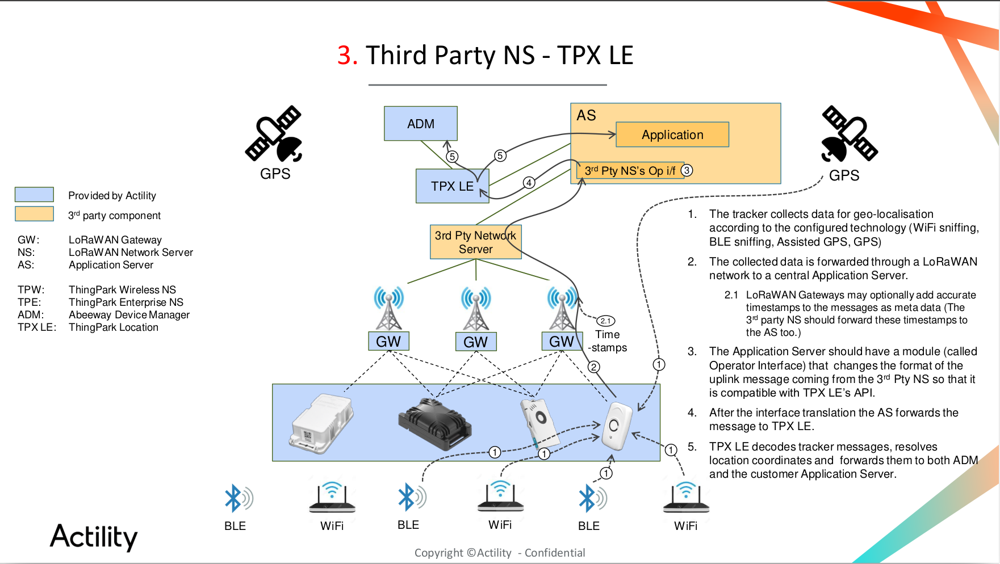

### overview with Dashboard
---------------------------------------


### Dataflow


### Sensors 
---------------------------------------
- GPS trackers:
    - Abeeway, APIs can be find [here](https://dx-api.thingpark.com/getstarted/#/).
        - Batch update tracker's parameters. [Link](https://dx-api.thingpark.com/location-trackercommand/latest/doc/index.html).
        - Renew the token that is used to config the node-red for 3rd-party integration. [Link](https://dx-api.thingpark.com/admin/latest/doc/index.html)
        - Send a copy of data to our server. [Link](https://dx-api.thingpark.com/location-connector/latest/doc/index.html#connector-configurations-retrieval)
        - Binder configuration that allows sending downlink to 3rd-party trackers (other than Abeeway trackers). [Link](https://dx-api.thingpark.com/location/latest/doc/index.html)
        - Abeeway Data Management: [Link](https://thingparkenterprise.eu.actility.com/thingpark/abeewayDeviceAnalyzer/index.php?dxprofile=thingparkenterprise)
    - kerlink, API [[Docs](https://wmc-poc.wanesy.com/gms/application/doc#introduction)], [[Swagger-UI](https://wmc-poc.wanesy.com/gms/?url=/gms/application/openapi)].
        - generate the Token that is used for 3rd-party integration. [Link](https://wmc-poc.wanesy.com/gms/?url=/gms/application/openapi#/login/login)
- Rain gauge & Water level
    - Decentlab, provide python compatable API and data format, APIs can be found [here](https://docs.decentlab.com/data-access-guide/v5/api/python-ref.html)
    - Login URL: https://nmsu.decentlab.com/login

### Implementation
---------------------------------------------------------------------------------
- All the tracifcs are wrapped through [ngrok.com](https://ngrok.com/)
    - Data receiving: http://data-receiving.ngrok.io
    - 3rd-party integration: https://3rd-party-integration.ngrok.io
- Receiving data:
    - listener the `5000` port, waiting for the data sent from Abeeway that is configurated by [the location connector API](https://dx-api.thingpark.com/location-connector/latest/doc/index.html#connector-configurations-retrieval). Source ode`src/gps_webhook_listener_flask.py`.
    - The received data is in the JSON formation. The code parses the JSON data. Two branches 1) append to the log file (store the raw json data everyday), 2) append to the CSV file (read-friendly and also each day).
    - Sample data, [JSON Log file](2021_06_01_gps.log), [CSV file](2021_06_01.csv)
- Beside receiving the data, two calculations are conducted:
    - *calculation the area of convex hull of each cow each day*. https://docs.scipy.org/doc/scipy/reference/generated/scipy.spatial.ConvexHull.html. 
        - Only consider the recoards that ``messageType == "POSITION_MESSAGE"``
        - Project the GPS data first. 
    - *Counts the quality of received data* to check the frequency of the receving issues. 
        1.  `` expected sequence number - received number of data``, 
        2.  `` number of data that validate=new - number of data that validate=(previous|invalid)``.
    - Calculating at ``00:10, 06:00, 12:00, 18:00, 23:00`` everyday.

- Update Parameters, send http requestion to given API addresses. The code can be found under ```TrackerParameters```.
- Decentlab sample code can be found under ```Sensors```.
- Code related to receive data, ```src```.
- Basic statistics and calculation, ```statistics```.

### Start server:
---------------------------------
1. Start Ngork: 
&nbsp;&nbsp;&nbsp;&nbsp; ``Execute the command: ngrok.exe http -region=us -hostname=data-receiving.ngrok.io 5000 ``
2. Update the API configuration by using the new URL(If needed)  
    1. ``Open the API configuration URL https://dx-api.thingpark.com/getstarted/#/ ``
    2. ``Login with your credential. The target profile indentifier = tpe-eu-api`` 
    3. ``Type in your username and password, generate the new token``  
    4. ``Get the tracker's configuration`` 
    5. ``Update the url of the 3rd-party application server``
3. Start the python scripts,
    1. Start the servers: ``src\gps_webhook_listener_flask.py ``
    2. MCP calculation: ``python MCPCalculation.py``
    3. Counter calculation: ``python record_count.py``
4. Update the credential information for the 3rd-party integration:
    1. renew the Abeeway token (login to generate a new token, or renew the old token from the code)
    2. renew the Kerlink token (https://wmc-poc.wanesy.com/gms/?url=/gms/application/openapi#/login/login)
    
### 3rd-party integration
----------------------------------------------------------------------------------
Access the node-red configuration: http://3rd-party-integration.ngrok.io/.
- https://nano-things.net/red
- https://github.com/actility/thingpark-integrations/tree/main/3_NS-NIT-tpLS/NIT